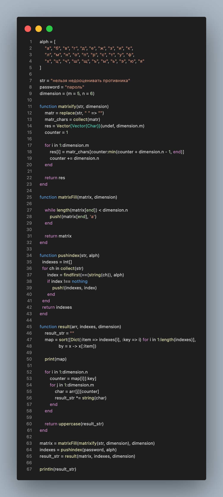
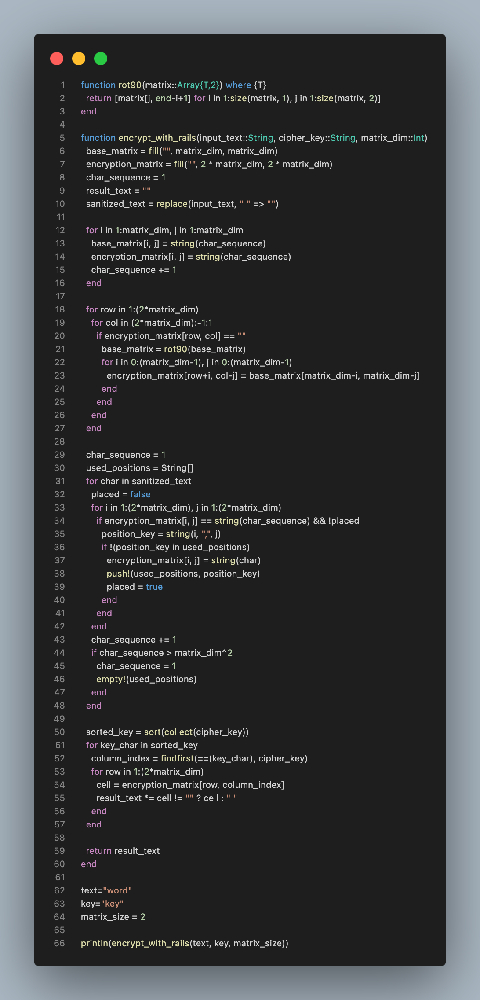
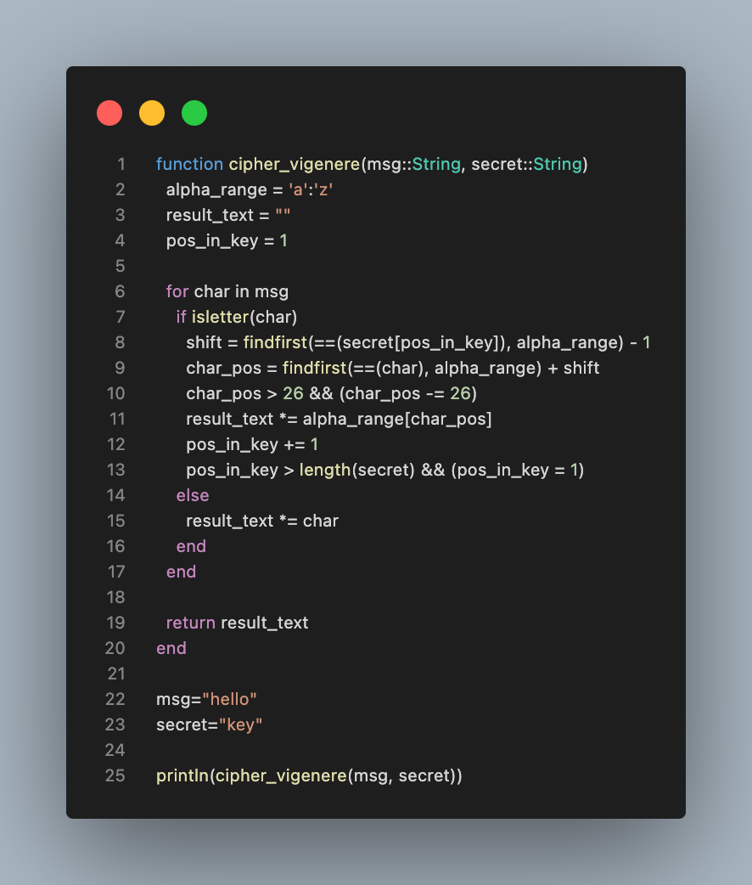

---
## Front matter
title: "Лабораторная работа №2"
subtitle: "Шифры перестановки"
author: "Кузнецов Юрий Владимирович"

## Generic options
lang: ru-RU
toc-title: "Содержание"

## PDF output format
toc: true # Table of contents
toc-depth: 2
fontsize: 12pt
papersize: a4
documentclass: beamer

## Fonts
mainfont: Noto Serif
romanfont: Noto Serif
sansfont: Noto Sans
monofont: Noto Mono
mainfontoptions: Ligatures=TeX
romanfontoptions: Ligatures=TeX
sansfontoptions: Ligatures=TeX,Scale=MatchLowercase
---

# Введение

## Введение

В данной презентации будет представлена реализация шифров перестановки

## Основные темы

- Маршрутное шифрование
- Шифрование с помощью решеток
- Таблица Виженера

# Маршрутное шифрование

## Маршрутное шифрование

{width=10%}

# Шифрование с помощью решеток

## Шифрование с помощью решеток

{width=10%}

# Таблица Виженера

## Таблица Виженера

{width=30%}

# Заключение

## Заключение

В ходе выполнения лабораторной работы, были изучены и запрограммированы шифры перестановки (Маршрутное шифрование, Шифрование с помощью решеток, Таблица Виженера)
