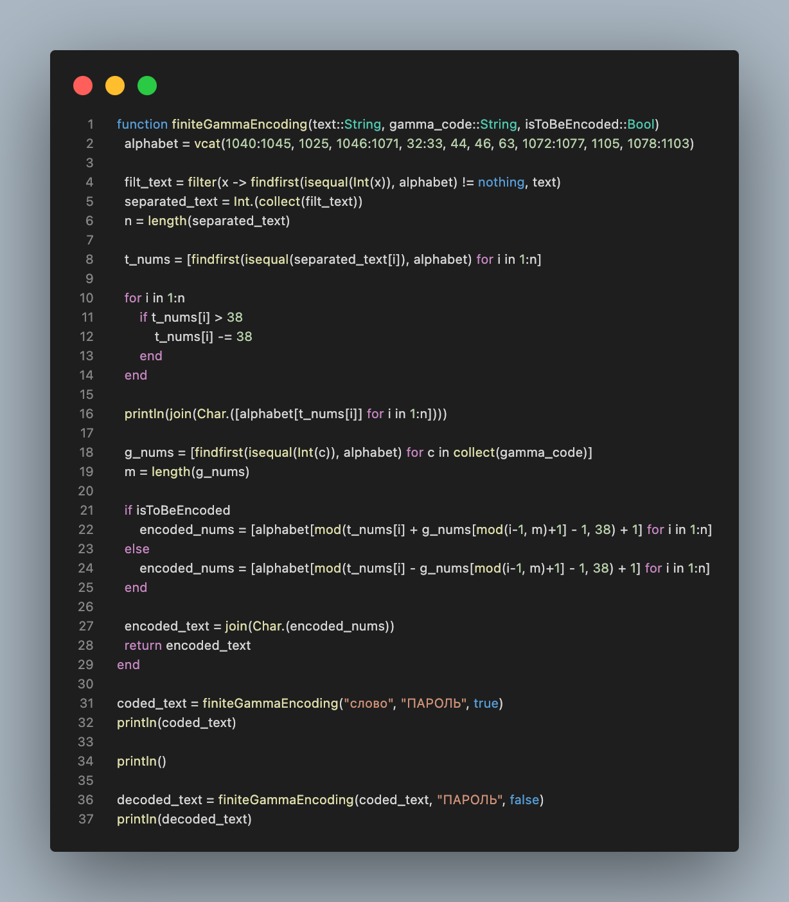

---
## Front matter
title: "Лабораторная работа №3"
subtitle: "Шифрование Гаммированием"
author: "Кузнецов Юрий Владимирович"

## Generic options
lang: ru-RU
toc-title: "Содержание"

## PDF output format
toc: true # Table of contents
toc-depth: 2
fontsize: 12pt
papersize: a4
documentclass: beamer

## Fonts
mainfont: Noto Serif
romanfont: Noto Serif
sansfont: Noto Sans
monofont: Noto Mono
mainfontoptions: Ligatures=TeX
romanfontoptions: Ligatures=TeX
sansfontoptions: Ligatures=TeX,Scale=MatchLowercase
---

# Введение

## Введение

В данной презентации будет представлена реализация шифрования Гаммированием

## Основные темы

- Шифрование Гаммированием

# Шифрование Гаммированием

## Шифрование Гаммированием

{width=40%}

# Заключение

## Заключение

В ходе выполнения лабораторной работы, было изучено и запрограммировано шифрование Гаммированием
