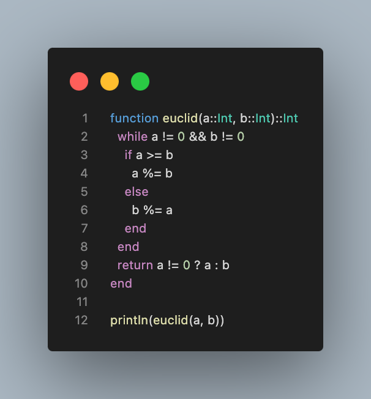
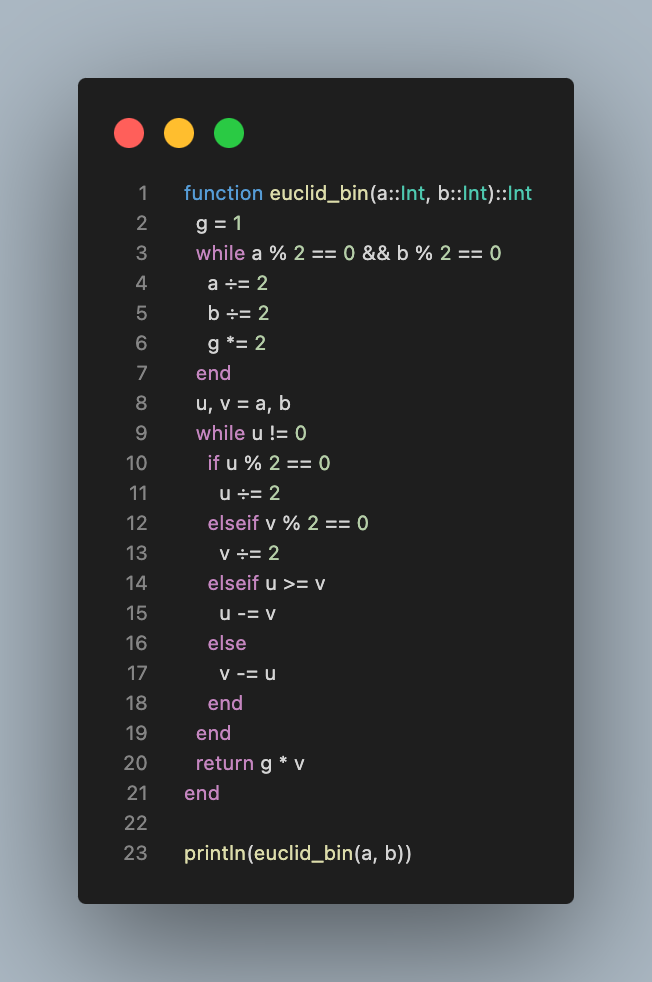
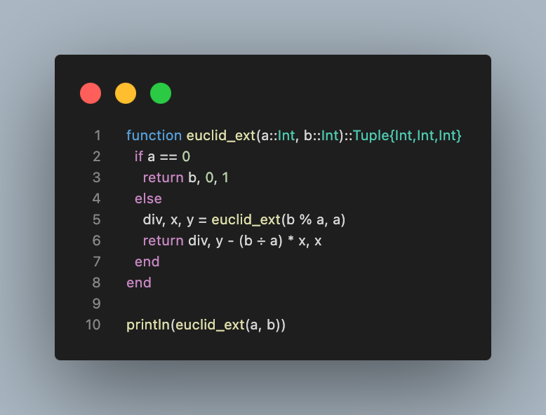
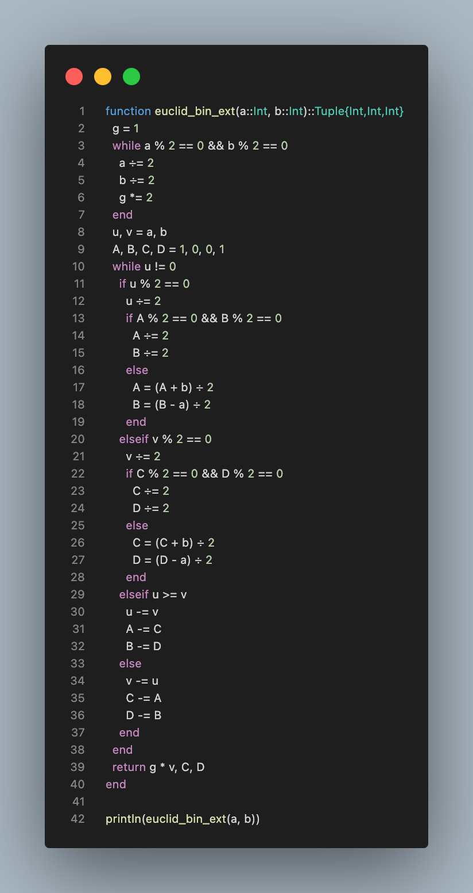

---
## Front matter
title: "Лабораторная работа №4"
subtitle: "Вычисление наибольшего общего делителя"
author: "Кузнецов Юрий Владимирович"

## Generic options
lang: ru-RU
toc-title: "Содержание"

## PDF output format
toc: true # Table of contents
toc-depth: 2
fontsize: 12pt
papersize: a4
documentclass: beamer

## Fonts
mainfont: Noto Serif
romanfont: Noto Serif
sansfont: Noto Sans
monofont: Noto Mono
mainfontoptions: Ligatures=TeX
romanfontoptions: Ligatures=TeX
sansfontoptions: Ligatures=TeX,Scale=MatchLowercase
---

# Введение

## Введение

В данной презентации будет представлена реализация вычисления наибольшего общего делителя

## Основные темы

- Алгоритм Евклида
- Бинарный алгоритм Евклида
- Расширенный алгоритм Евклида
- Расширенный бинарный алгоритм Евклида

# Алгоритм Евклида

## Алгоритм Евклида

{width=50%}

# Бинарный алгоритм Евклида

## Бинарный алгоритм Евклида

{width=50%}

# Расширенный алгоритм Евклида

## Расширенный алгоритм Евклида

{width=50%}

# Расширенный бинарный алгоритм Евклида

## Расширенный бинарный алгоритм Евклида

{width=30%}

# Заключение

## Заключение

В ходе выполнения лабораторной работы, были изучены и запрограммированы вычисления наибольшего общего делителя

