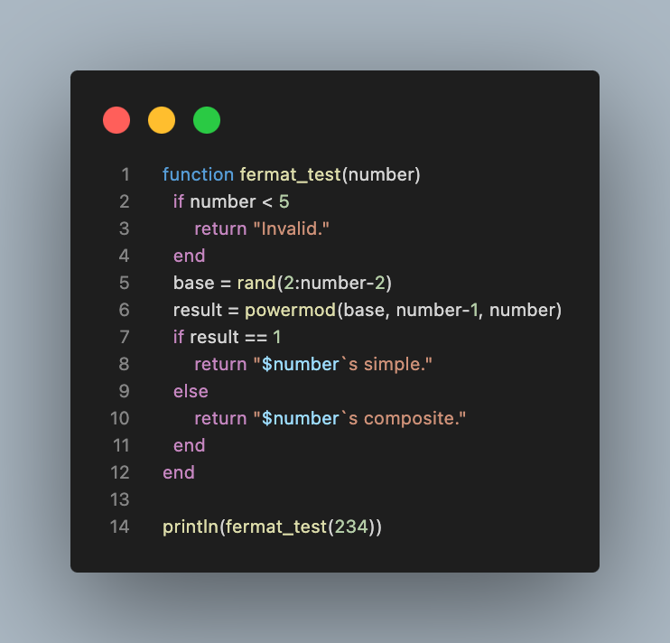
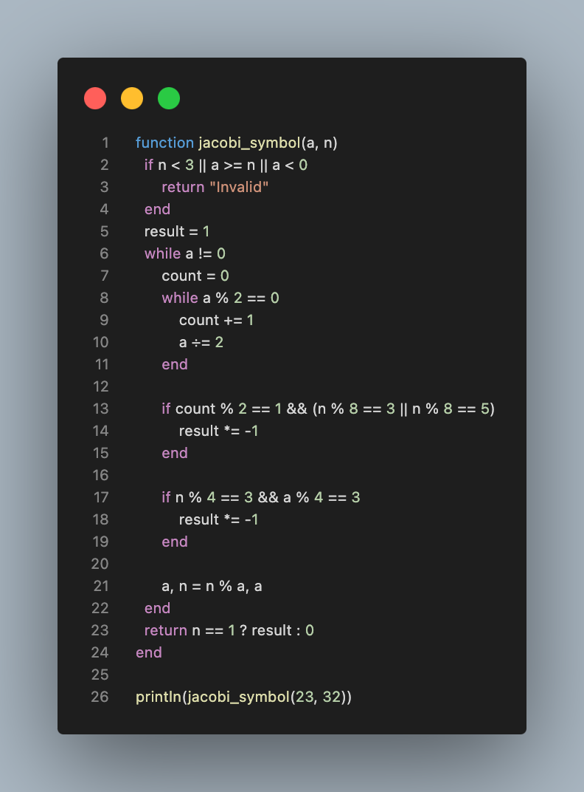
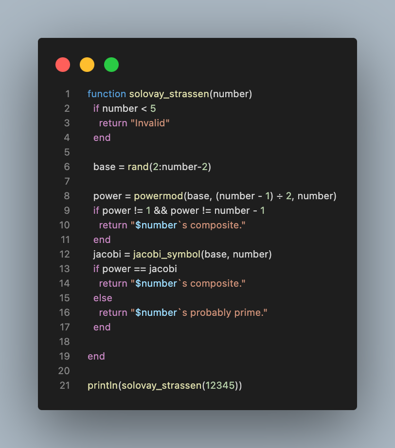
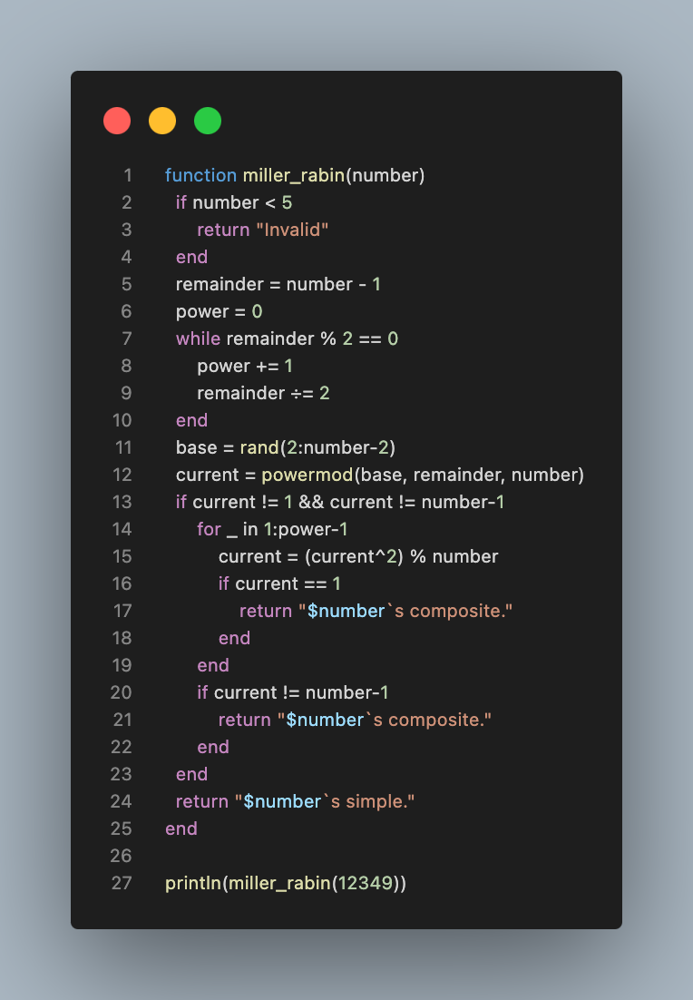

---
## Front matter
title: "Лабораторная работа №5"
subtitle: "Вероятностные алгоритмы проверки чисел на простоту"
author: "Кузнецов Юрий Владимирович"

## Generic options
lang: ru-RU
toc-title: "Содержание"

## PDF output format
toc: true # Table of contents
toc-depth: 2
fontsize: 12pt
papersize: a4
documentclass: beamer

## Fonts
mainfont: Noto Serif
romanfont: Noto Serif
sansfont: Noto Sans
monofont: Noto Mono
mainfontoptions: Ligatures=TeX
romanfontoptions: Ligatures=TeX
sansfontoptions: Ligatures=TeX,Scale=MatchLowercase
---

# Введение

## Введение

В данной презентации будет представлена реализация вероятностных алгоритмов проверки чисел на простоту

## Основные темы

- Тест Ферма
- Символ Якоби
- Тест Соловэя-Штрассена
- Тест Миллера-Рабина

# Тест Ферма

## Тест Ферма

{width=50%}

# Символ Якоби

## Символ Якоби

{width=50%}

# Тест Соловэя-Штрассена

## Тест Соловэя-Штрассена

{width=50%}

# Тест Миллера-Рабина

## Тест Миллера-Рабина

{width=30%}

# Заключение

## Заключение

В ходе выполнения лабораторной работы, были изучены и запрограммированы вероятностные алгоритмы проверки чисел на простоту

