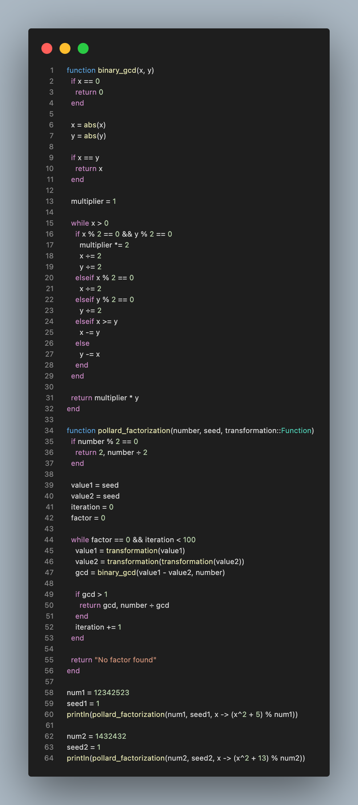

---
## Front matter
title: "Лабораторная работа №6"
subtitle: "Разложение чисел на множители"
author: "Кузнецов Юрий Владимирович"

## Generic options
lang: ru-RU
toc-title: "Содержание"

## PDF output format
toc: true # Table of contents
toc-depth: 2
fontsize: 12pt
papersize: a4
documentclass: beamer

## Fonts
mainfont: Noto Serif
romanfont: Noto Serif
sansfont: Noto Sans
monofont: Noto Mono
mainfontoptions: Ligatures=TeX
romanfontoptions: Ligatures=TeX
sansfontoptions: Ligatures=TeX,Scale=MatchLowercase
---

# Введение

## Введение

В данной презентации будет представлена реализация разложения чисел на множители

## Основные темы

- Метод Полларда

# Метод Полларда

## Метод Полларда

{width=50%}

# Заключение

## Заключение

В ходе выполнения лабораторной работы, было изучено и запрограммировано разложение чисел на множители

